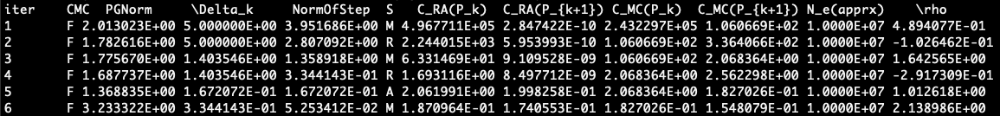

======================================================
Interfacing with MF-STRO-DF
======================================================

.. _mfstrodf_input:

Inputs
~~~~~~~~~~~~

.. _mfstrodf_input_algo_parameters:

Algorithm parameters
*********************

The algorithm parameters are used to specify the problem and algorithm metrics of
MF-STRO-DF. These parameters are specified in JSON format and the structure and keys of
the expected algorithm parameters JSON is given below.

.. code-block:: json
    :force:

    {
        "tr": {
            "radius":
            "max_radius":
            "min_radius":
            "center": [

            ]
            "mu":
            "eta":
        },
        "param_names": [

        ]
        "param_bounds": [

        ]
        "kappa":
        "max_fidelity":
        "usefixedfidelity":
        "N_p":
        "dim":
        "theta":
        "thetaprime":
        "fidelity":
        "max_iteration":
        "max_fidelity_iteration":
        "min_gradient_norm":
        "max_simulation_budget":
        "output_level":
    }

The data type, description, and example values for each key in the algorithm parameters JSON
is given below.

* **radius**: ``float`` initial trust region radius

  .. code-block:: json
    :force:

      "radius": 5.0

* **max_radius**: ``float`` maximum value allowed for the trust region radius

  .. code-block:: json
    :force:

      "max_radius": 20.0,

* **min_radius**: ``float`` minimum value allowed for the trust region radius

  .. code-block:: json
    :force:

      "min_radius": 1.0e-5,

* **center**: ``array<float>`` starting point or the center of the initial trust region

  .. code-block:: json
    :force:

    "center": [
        2.13681979279795745,
        -2.7717580840968665,
        3.2082901878570345
    ],

* **mu**: ``float`` surrogate model precision constant that is used as a factor to check
  model precision if current iterate is close to minimum

  .. code-block:: json
    :force:

      "mu": 0.01,

* **eta**: ``float`` surrogate model fitness threshold that used as upper bound for significant
  reduction condition :math:`\rho`

  .. code-block:: json
    :force:

      "eta": 0.01

* **param_names**: ``array<str>`` names of the parameter dimensions

  .. code-block:: json
    :force:

    "param_names": [
      "x",
      "y",
      "z"
    ],

* **param_bounds** `(optional)`: ``array<array<float>>`` minimum and maximum bounds of the parameter dimensions

  .. code-block:: json
    :force:

    "param_bounds": [
      [-4.0,4.0],
      [-5.0,5.0],
      [-3.0,3.0]
    ],

* **kappa**: ``float`` adaptive sampling constant that is used in the bound
  to check the accuracy of the Monte Carlo simulator. The higher this number is
  the more the standard deviation of the simulator can be for its samples to be
  accepted as accurate sample for any given trust region radius and fidelity

  .. code-block:: json
    :force:

      "kappa":100

* **max_fidelity**: ``int`` maximum fidelity allowed for the Monte Carlo simulator

  .. code-block:: json
    :force:

      "max_fidelity":10000000

* **usefixedfidelity** `(optional, defaults to true)`: ``boolean`` set to true if
  fixed fidelity level is to be used, and set to false to use multiple levels of
  fidelity

  .. code-block:: json
    :force:

      "usefixedfidelity":false

* **N_p**: ``int`` number of parameters points to interpolate and run the
  simulator within the trust region of each iteration

  .. code-block:: json
    :force:

      "N_p": 10

* **dim**: ``int`` number of parameter dimensions. This number should match the
  number of elements in the values associated with the keys: `param_bounds`,
  `param_names`, and `center`

  .. code-block:: json
    :force:

      "dim": 3

* **theta**: ``float`` used as a factor in the calculation of minimum distance
  between the interpolation parameters of the trust region. The higher this value,
  the more distance a parameter needs to be with respect to all other parameters

  .. code-block:: json
    :force:

      "theta": 0.01

* **thetaprime**: ``float`` Used as a factor in the calculation of equivalence
  distance between the new interpolation parameters and those parameters
  on which the simulation was performed in the previous iterations. The lower this
  value, the closer the old parameters need to be to the new parameters to be selected
  for reuse

  .. code-block:: json
    :force:

      "thetaprime": 0.0001

* **fidelity**: ``int`` fidelity value when ``usefixedfidelity = false`` and
  initial fidelity value when ``usefixedfidelity = true``

  .. code-block:: json
    :force:

      "fidelity": 1000

* **max_iteration**: ``int`` maximum number of iterations, the algorithm can run for

  .. code-block:: json
    :force:

      "max_iteration":50

* **max_fidelity_iteration**: ``int`` number of iterations for which the the fidelity
  can be at the maximum value (only applicable when ``usefixedfidelity = false``)

  .. code-block:: json
    :force:

      "max_fidelity_iteration":5

* **min_gradient_norm**: ``float`` lower bound for the (projected) gradient norm

  .. code-block:: json
    :force:

      "min_gradient_norm": 0.00001

* **max_simulation_budget**: ``int`` maximum cumulative sum of the simulations (fidelity)
  allowed across all iterations

  .. code-block:: json
    :force:

      "max_simulation_budget":1000000000000000

* **output_level**: ``int`` output level. The mapping of values to the output printed to console is:

  * 0: quiet, dont print anything except for the output message
  * 10: everything printed in the previous level plus the single line optimization output (see :ref:`below<mfstrodf_output_single_line>`)
  * 11: everything printed in the previous level plus the next iterate value
  * 20: everything printed in the previous level plus interpolation points in every iteration
  * 30: everything printed in the previous level plus value of the subproblem function at the new iterate
  * 40: everything printed in the previous level plus norm of the step taken in each iteration
  * 50: verbose/debug mode. Print everything

  .. code-block:: json
    :force:

      "output_level":0

.. _mfstrodf_input_config:

Configuration inputs
*********************

The configuration inputs are used to specify the configuration in which to run
MF-STRO-DF. These inputs are specified in JSON format and the structure and keys of
the expected configuration inputs JSON is given below.

.. code-block:: json
    :force:

    {
        "mc":{
          "caller_type":
          "class_str":
          "location_str":
          "ranks":
          "parameters":{

          }
        },
        "model":{
          "parameters":{

          },
          "function_str":{

          }
        },
        "subproblem":{
          "parameters":{

            "optimization":{

            }
          },
          "function_str":
        }
    }

The data type, description, and examples for each key in the configuration inputs JSON
is given below.

* **mc**: ``object`` configuration of the Monte Carlo simulator. The keys within
  this object include:

  * caller_type: ``str``

    * use ``function call`` as value to run the simulator using a
      function call. Specify the name of class within
      ``mfstrodf.mc`` as value of ``class_str``
    * use ``script run`` as value to run the simulator by calling a script. For
      this kind of a call, in addition specifying the name of class within
      ``mfstrodf.mc`` as value of ``class_str``, the location of the script also needs
      to be specified as value of ``location_str``
    * use ``workflow`` as value to run the simulator as a task in decaf henson
      workflow. Specify the name of class within ``mfstrodf.mc`` as value
      of ``class_str``

  * **class_str**: ``str`` name of class within ``mfstrodf.mc``
  * **location_str**: ``str`` location of script when ``caller_type`` is ``script_run``
  * **ranks**: ``int`` number of MPI ranks to use to run the simulator when
    ``caller_type`` is ``script_run``
  * **parameters**: ``object`` parameters to be during the simulation run. This
    object will be passed as is to the function or script or workflow task and will
    not be processed by the optimization code

  .. code-block:: json
    :force:

    "mc":{
      "caller_type":"script run",
      "class_str":"SumOfDiffPowers",
      "location_str":"<path to mc script>",
      "ranks":1,
      "parameters":{"mc_params":"<path to mc params>"}
    }

* **model**: ``object`` configuration of the surrogate model. The keys within
  this object include:

  * **function_str**: ``object`` for each type of data generated by the Monte
    Carlo simulator, specify the name of the function within ``mfstrodf.ModelConstruction``
    to use for surrogate model construction. For instance, if the simulator produces value and error
    values, then this object will have two keys whose values will specify the name
    of functions within ``mfstrodf.ModelConstruction`` to use for surrogate model construction.
    For more information on available functions in mfstrodf.ModelConstruction
    or how to create your own, see :ref:`models<mfstrodf_model>`
  * **parameters**: ``object`` in addition to the interpolation parameters within
    the trust region and the corresponding values generated by the simulator,
    the key-value pairs in this object will be used as parameters for surrogate model
    creation in function specified in ``function_str``.

  .. code-block:: json
    :force:

    "model":{
      "function_str":{
        "MC":"appr_pa_m_construct",
        "DMC":"appr_pa_m_construct"
      },
      "parameters":{
        "MC":{"m":2},
        "DMC":{"m":1}
      }
    }

* **subproblem**: ``object`` configuration of the trust region subproblem. The keys within
  this object include:

  * **function_str**: ``str`` specify the name of the function within ``mfstrodf.TRSubproblem``
    to use for subproblem object construction. For more information on available functions in mfstrodf.TRSubproblem
    or how to create your own, see :ref:`models<mfstrodf_subproblem>`
  * **parameters**: ``object`` the key-value pairs in this object will be used as
    parameters for subproblem object creation in function specified in ``function_str``.
    Additionally, the parameters object contains an additional key to specify
    optimization parameters

      * **optimization**: ``object`` the the key-value pairs in this object are
        used as parameters by the minimize function in the subproblem object
        obtained by running the function specified in ``function_str``.

  .. code-block:: json
    :force:

    "subproblem":{
      "function_str":"appr_tuning_objective_without_error_vals",
      "parameters":{
        "data":"if the key data does not give the path of the data JSON file then the value of 0 and error of 1 is assumed",
        "weights":"if the key weights does not give the path to the weights file then a weight of 1 is assumed",
        "optimization":{
          "nstart":5,
          "nrestart":10,
          "saddle_point_check":false,
          "minimize":true,
          "use_mpi":true
        }
      }
    }

.. _mfstrodf_output:

Outputs
~~~~~~~~~~~~

.. _mfstrodf_output_single_line:

One line output
*********************

For each iteration, the MF-STRO-DF algorithm generates one line output describing the
progress of the optimization when :math:`output\_level\ge10` in the
:ref:`algorithm parameters inputs<mfstrodf_input_algo_parameters>`. An example snippet of the one
line output and the description of each column is given below:

* **iter**: current iteration number
* **CMC**: check minimum condition

  * ``T``: True if the current iterate is found to be close to the minimum
  * ``F``: False if the current iterate is not found to be close to the minimum

* **PGNorm**: Projected gradient norm
* **\Delta_k**: trust region radius
* **NormOfStep**: norm of the step from current iterate to next iterate
* **S**: Status

  * ``M``: Moved, trust region center moved to the next iterate but the trust region
    radius remains the same
  * ``A``: Accept, trust region center moved to the next iterate and the trust region
    radius doubled
  * ``R``: Reject, trust region center stays at the current iterate and the trust region
    radius halved

* **C_RA(P_k)**: subproblem function value with values from the surrogate model obtained at the current iterate
* **C_RA(P_{k+1})**: subproblem function value with values from the surrogate model obtained at the next iterate
* **C_MC(P_k)**: subproblem function value with values from the simulator run at the current iterate
* **C_MC(P_{k+1})**: subproblem function value with values from the simulator run at the next iterate
* **N_e(apprx)**: current fidelity
* **\rho**: sufficient decrease condition :math:`\rho`

.. _mfstrodf_output_exit_codes:

Exit Codes
~~~~~~~~~~~~

The exit codes and messages maintained by MF-STRO-DF algorithm are given below.

* 0: OK
* 1: Norm of the projected gradient too small
* 2: Max iterations reached
* 3: Simulation budget depleted
* 4: MC was successful on less than 1 or N_p parameters (error)
* 5: Trust region radius is an order of magnitude smaller than the radius at which max fidelity was reached
* 6: Fidelity has been at a maximum value for the specified number of iterations
* 7: The usable MC output was less than what was needed for constructing a model. It is possible that too many parameters yielded MC output that was either nan or infty
* 8: Failure:
* 9: Trust region radius is less than the specified minimum bound
* 10: The subproblem solution indicates that the current iterate is very similar to the previous iterate. This could happen because all of the same parameters from the previous iteration got selected within the trust region of the current iteration. The solver cannot continue. Quitting now
